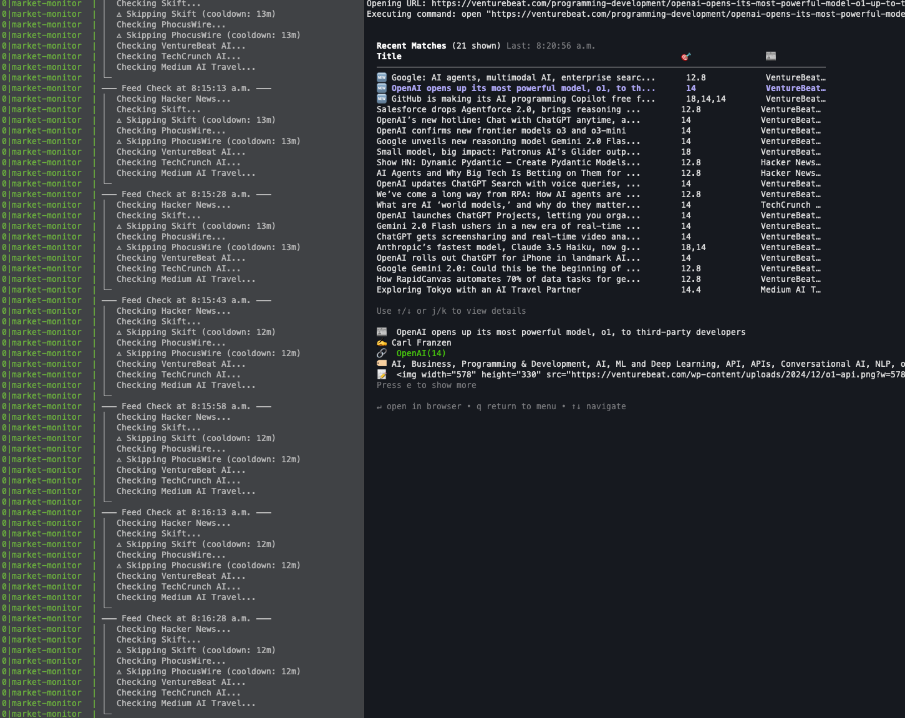

# Market Monitor

A terminal-based RSS feed monitoring tool that tracks keywords across configured sources, with support for weighted matching and real-time notifications.

## Features

- 📊 Real-time RSS feed monitoring
- 🔍 Customizable keyword matching (exact, fuzzy, or phrase matching)
- ⚖️ Weighted keyword system for prioritizing matches
- 🖥️ Interactive terminal UI
- 🔔 Desktop notifications for matches
- 📝 Persistent storage of matched items



## Installation

```bash
# Install dependencies
npm install

# Build the project
npm run build
```

## Configuration

Create a `config.json` file in the root directory:

```json
{
  "sources": [
    {
      "type": "rss",
      "url": "https://venturebeat.com/category/ai/feed/",
      "name": "VentureBeat AI",
      "keywords": [
        {
          "value": "AI travel",
          "type": "phrase",
          "weight": 10
        }
      ],
      "useGlobalKeywords": true
    }
  ]
}
```

### Keyword Configuration Options
- `value`: The keyword to match
- `type`: Match type ('exact', 'fuzzy', or 'phrase')
- `weight`: Importance score (1-10, default: 5)
- `caseSensitive`: Whether case matters (default: false)

## Usage

### Monitor Management

```bash
# Start the monitor as a background process
npm run monitor:start

# Stop the monitor
npm run monitor:stop

# Check monitor status
npm run monitor:status

# View monitor logs
npm run monitor:logs

# Run monitor directly (not as a background process)
npm run watch
```

### Interactive UI

Launch the terminal-based interface:
```bash
npm run ui
```

Navigate using:
- ↑/↓ or j/k: Move selection
- Enter: Select option
- Tab: Switch focus
- q: Quit

### Managing Keywords

```bash
# Add a new keyword
node dist/index.js keywords add "your keyword" [options]

# List all keywords
node dist/index.js keywords list

# Remove keywords interactively
node dist/index.js keywords remove
```

Options for adding keywords:
- `-t, --type <type>`: Match type (exact/fuzzy/phrase)
- `-w, --weight <number>`: Keyword weight (1-10)
- `-c, --case-sensitive`: Enable case-sensitive matching

Example:
```bash
node dist/index.js keywords add "AI travel" -t phrase -w 8
```

## Data Storage

Matched items are stored in `data/feeds.json` with:
- 30-day retention period
- Maximum of 2000 stored items
- Automatic cleanup of old entries

## UI Screens

- 📊 Monitor Status: View current monitor state and performance metrics
- 🔍 View Matches: Browse and search through matched items
- 🔑 Manage Keywords: Add/remove monitoring keywords
- ⚙️ Settings: Configure monitor behavior

## Source Configuration

Sources are managed through the `config.json` file. To add a new source:

1. Open `config.json`
2. Add a new source object to the `sources` array:

```json
{
  "sources": [
    {
      "type": "rss",
      "url": "https://venturebeat.com/category/ai/feed/",
      "name": "VentureBeat AI",
      "keywords": [
        {
          "value": "AI travel",
          "type": "phrase",
          "weight": 10
        }
      ],
      "useGlobalKeywords": true,
      "weight": 5
    }
  ]
}
```

### Source Configuration Options
- `type`: Currently only supports "rss"
- `url`: The RSS feed URL to monitor
- `name`: (Optional) A friendly name for the source
- `keywords`: (Optional) Array of keywords specific to this source
- `useGlobalKeywords`: Whether to use global keywords (true/false)
- `weight`: (Optional) Source importance score (1-10, default: 5)

### Example Adding Multiple Sources

```json
{
  "sources": [
    {
      "type": "rss",
      "url": "https://venturebeat.com/category/ai/feed/",
      "name": "VentureBeat AI",
      "useGlobalKeywords": true
    },
    {
      "type": "rss",
      "url": "https://techcrunch.com/tag/artificial-intelligence/feed/",
      "name": "TechCrunch AI",
      "useGlobalKeywords": true
    }
  ]
}
```

After updating the config file, restart the monitor:
```bash
npm run monitor:stop
npm run monitor:start
```
